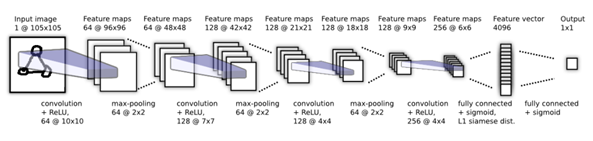
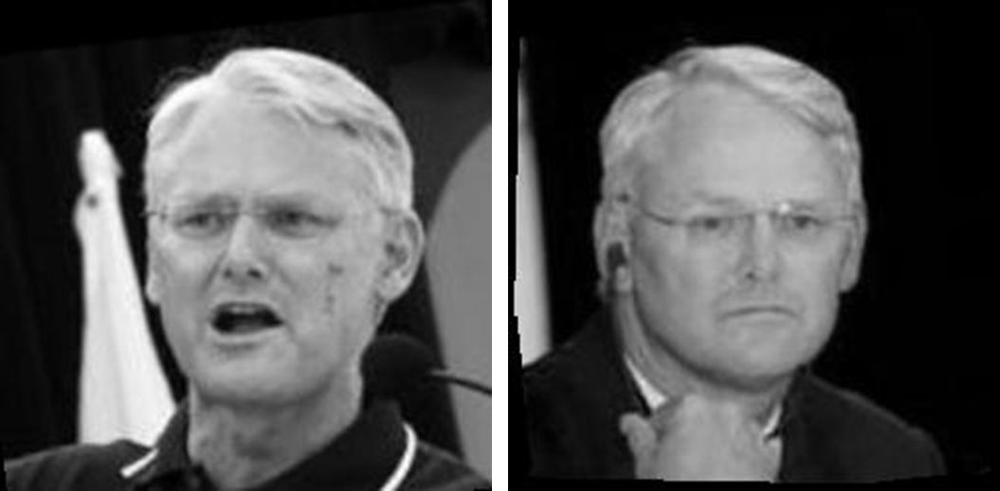
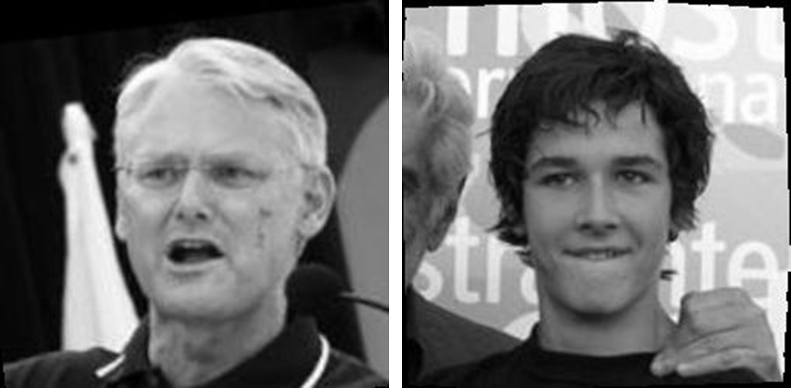
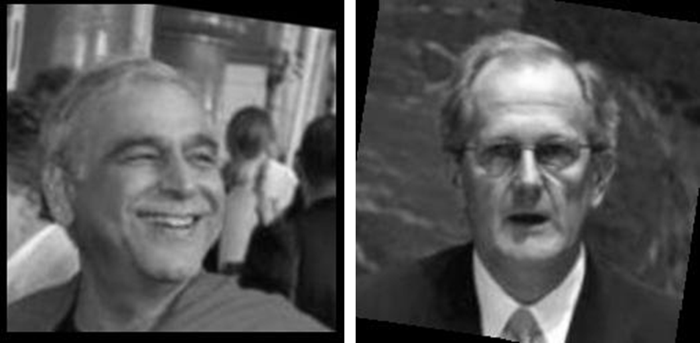
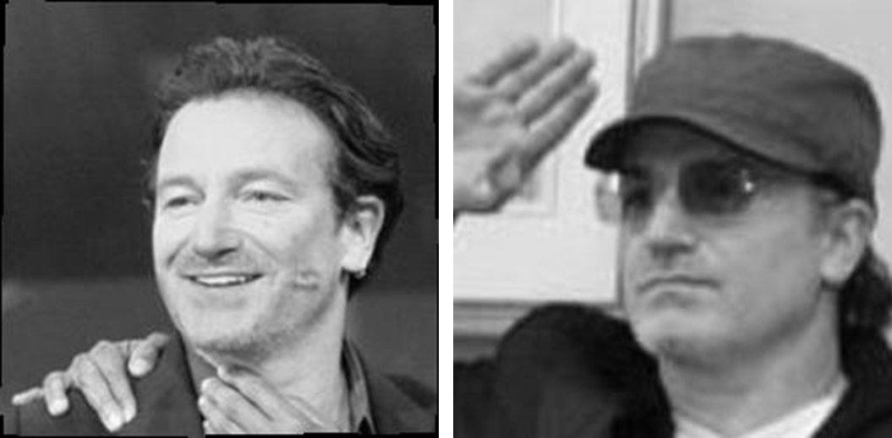

# Siamese Neural Network for Face Verification

This project implements a **Siamese Neural Network** for face verification using the [LFW (Labeled Faces in the Wild)](http://vis-www.cs.umass.edu/lfw/) dataset. The goal is to classify whether a given pair of facial images belongs to the same person.

---

## Model Architecture

The model follows a Siamese CNN structure with the architecture inspired by the paper:  
*Each twin network contains a series of convolutional layers followed by a fully connected layer. The L1 distance between the 4096-dim vectors is calculated and passed through a final sigmoid activation.*
 

### Layer Structure

The architecture of each twin CNN is as follows:

| Layer | Input Size | Filters | Kernel Size | Stride | Activation | Maxpool | Maxpool Stride |
|-------|------------|---------|-------------|--------|------------|---------|----------------|
| Conv1 | 1@105x105  | 64      | 10x10       | 1      | ReLU       | 2x2     | 2              |
| Conv2 | 64@48x48   | 128     | 7x7         | 1      | ReLU       | 2x2     | 2              |
| Conv3 | 128@21x21  | 128     | 4x4         | 1      | ReLU       | 2x2     | 2              |
| Conv4 | 128@9x9    | 256     | 4x4         | 1      | ReLU       | -       | -              |
| FC1   | 256@6x6    | -       | -           | -      | Sigmoid    | -       | -              |
| FC2   | L1 Distance Vector | - | -         | -      | Sigmoid    | -       | -              |

Regularization:
- Dropout: Best value found = `0.5`
- Weight decay: `0.0002`
- Optimizer: `Adam`
- Loss: `Binary Cross Entropy`

## Training Setup

- Validation Split: 20%
- Grid Search Hyperparameters:
  - Learning Rate: `[0.0005, 0.005, 0.05]`
  - Batch Size: `[16, 32, 64]`
  - Epochs: `[5, 10, 15]`
  - Dropout: `[0.2, 0.4, 0.5]`

- Best configuration found:
  - Learning Rate: `0.0005`
  - Batch Size: `16`
  - Epochs: `15`
  - Dropout: `0.5`

## Training Results

- Final Test Accuracy: **~71%**
- Validation Accuracy: **~72%**

---

## Prediction Examples

These are selected based on the network's confidence:

### True Positive  
**Person**: Gordon Campbell  
**Probability**: 0.9999  
> The model correctly identified the same individual.

### True Negative  
**Persons**: Gordon Campbell & Pierre Boulanger  
**Probability**: 8.573e-08  
> Correctly classified as different individuals.

### False Positive  
**Persons**: Ismail Merchant & Joseph Deiss  
**Probability**: 0.9997  
> Misclassified due to facial similarities and unclear angles.

### False Negative  
**Person**: Bono  
**Probability**: 3.01e-05  
> Misclassified due to occlusions like hat and sunglasses.

---

## Notes

- Implemented using **PyTorch Lightning**
- Supports **early stopping** based on validation accuracy
